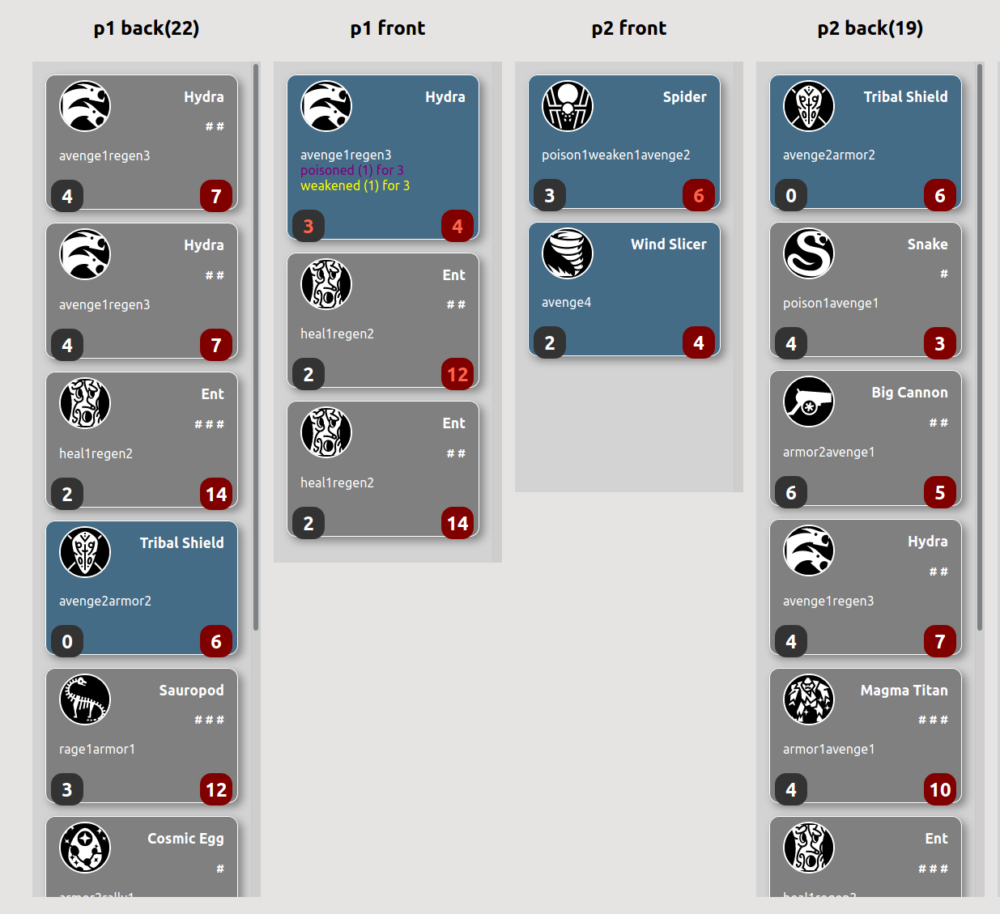

## ccg

a collectible card game

### Screenshot:



### Unit Abilities:

```
avenge: 'deal damage to attacker, bypasses armor',
poison:
  'applies poison on attack, dealing damage for 3 turns. Does not stack.',
pierce: 'part of attack that ignores armor',
ranged: 'attack from afar, immune to `avenge`.', // TODO
armor: 'reduce damage from each attack',
heal: 'heal adjacent allies per turn, only works in frontrow',
regen: 'heal self per turn',
rally: 'temporarily increase adjacent allies attack',
absorb: 'increase hp on kill, can exceed max hp',
rage: 'increase attack on kill, can exceed max attack',
weaken: 'reduce enemy attack for 3 turns. Does not stack.',
immune: 'immune to weaken and poison', // TODO
```

### Made with:

- [create-snowpack-app](./README_CSA.md) with starter react template
- [react-beautiful-dnd](https://github.com/atlassian/react-beautiful-dnd)
  - see [this example](https://codesandbox.io/s/jovial-leakey-i0ex5)
- [Valtio](https://github.com/pmndrs/valtio)
  - had to use 0.7.1 since [v0.8.0+ doesn't work w/ Snowpack](https://github.com/pmndrs/valtio/issues/110)
- All icons from https://game-icons.net/

### TODOS

- finish implementing special powers (RANGED, IMMUNE)
- better ergonomics for turns
